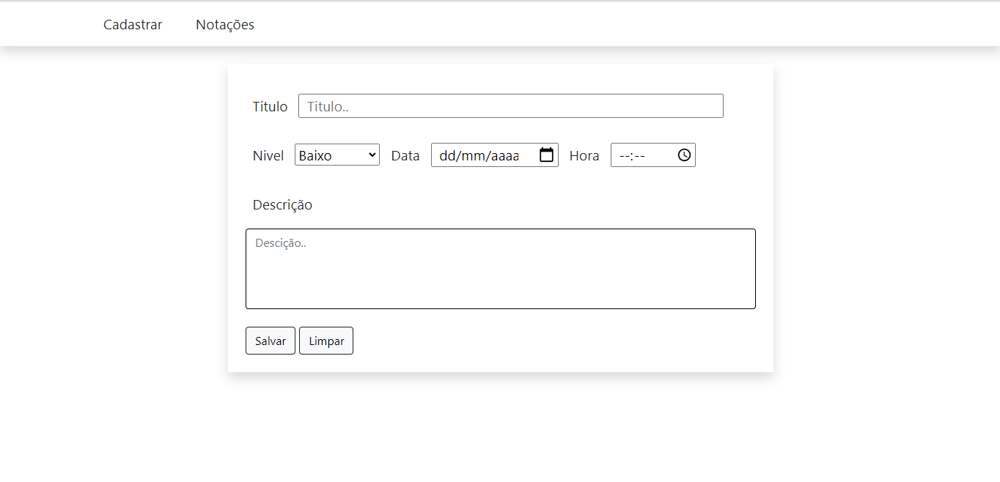
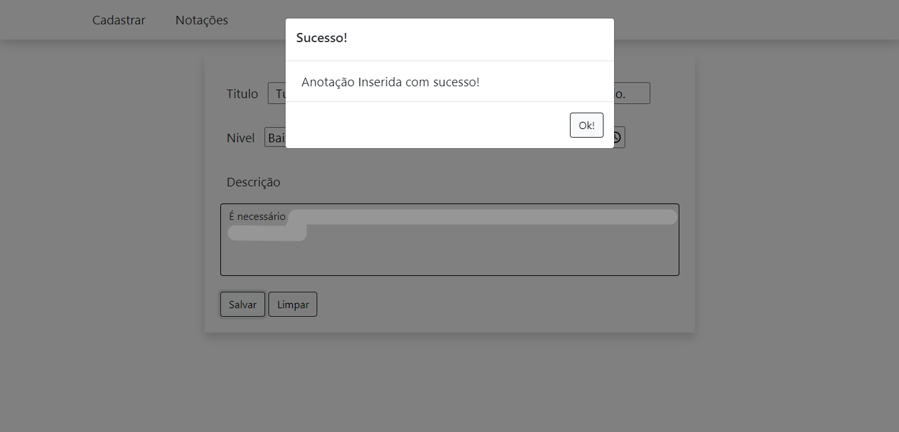
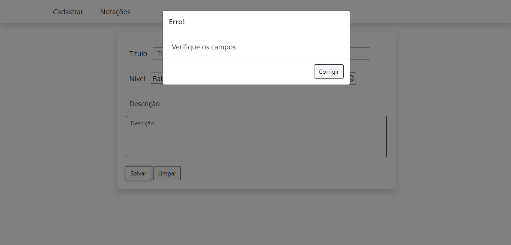
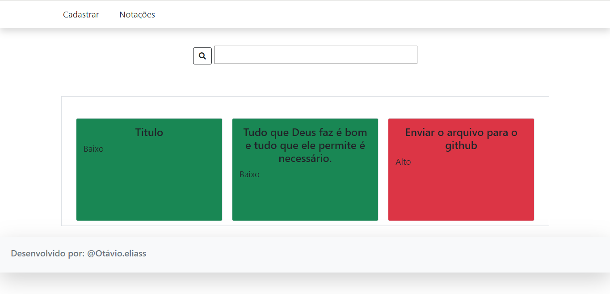
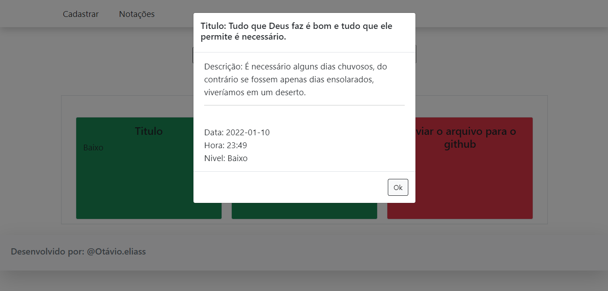

<h1>Anotações</h3>

<h3> Consumindo API </h3>

Eu particularmente gosto de anotar algumas atividades que fiz no dia, a fim de se necessário recupera-las para vizualizar se foi feita ou não junto com a data e hora, nesse projeto busquei desenvolver um pequeno sistema que me ajuda-se com isso, nele é possível cadastrar e visualizar anotações, a descrição coloquei para reforçar a memória da atividade caso o titulo não ajude.

API: <a href= "https://mockapi.io/">Mockup API</a>

<h2>Imagens</h2>

<h3>HOME</h3>

<h3>HOME - Sucesso</h3>

Caso todos os campos estejam preenchidos, o sistema vai cadastrar sua anotação.

<h3>HOME - Erro</h3>

Caso algum campo não tenha sido preenchido o sistema vai alerta-lo e não irá cadastrar sua anotação.

<h3>Anotações Cadastradas</h3>

As cores dos cards são definidas pelo seu nivel. Sendo elas:

<ol>
  <li>Baixo: Verde</li>
  <li>Médio: Amarelo</li>
  <li>Alto: Vermelho</li>
</ol>

<h3>Conteudo do Card</h3>

